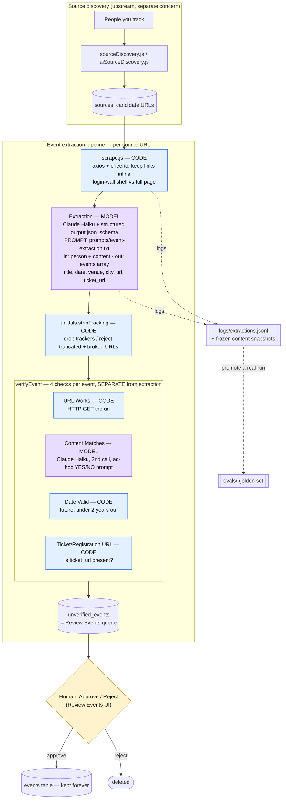

# Event pipeline — who decides what, and what's eval-covered

How a tracked person becomes events in the app, which **model/prompt** vs **plain code**
makes each decision, and where promptfoo does (and does not) test it.

## Flow

**Two model calls, two prompts** — don't confuse them:
1. **Extraction** (`promptTemplate.js` → `prompts/event-extraction.txt`): content → structured events. This is the one the promptfoo golden set tests.
2. **Content-match verification** (`extractEvents.js` `validateEventContent`): a *second, separate* Haiku call with its own ad-hoc "does this page match? YES/NO" prompt. Un-eval'd today.

Everything else is plain code.

## Your question: should the verification badges go in the extraction eval JSON?

**No.** The extraction eval answers one question — *"given this content, did we pull the right
events?"* The verification badges answer a different question — *"is this extracted event real
and valid?"* — and each badge has a different grader type:

| Badge | Produced by | Grader type | Where it should be tested |
|-------|-------------|-------------|---------------------------|
| **URL Works** | `verifyEvent` HTTP GET | deterministic + network | integration test (not promptfoo) |
| **Content Matches** | 2nd Claude call (LLM-as-judge) | model | a **separate** promptfoo eval — its own prompt + labeled cases |
| **Date Valid** | code (future & <2yr) | deterministic | unit test |
| **Registration/Ticket URL** | code (is `ticket_url` set) | deterministic | unit test |

So:
- **Three of four are not model calls** — they belong in unit/integration tests, not any prompt eval.
- **One is a model call** (Content Matches). If you want to trust it, give it its *own* promptfoo
  eval with its own fixtures (event + page → should-match / should-not-match). That's the
  "evaled separately" you intuited — a different prompt is a different eval.
- **Don't merge them into the extraction JSON.** That would test the extraction prompt against
  fields it never produces.

### The clean way to improve a badge: push the fact upstream into extraction

The "No Registration URL" warning is the example. Rather than make the *verification* smarter,
we taught the *extraction* prompt to pull the "Get tickets" link into a `ticket_url` field —
which **is** eval-covered (the Carnegie Hall golden case enforces it). The badge then just
reflects `ticket_url`. General rule (same as the extract-vs-enrich split):

> If the fact is in the content, extract it in the model (and guard it in the golden set).
> If it's a deterministic check, do it in code (and guard it in a unit test).
> Only reach for an LLM-judge when the check is genuinely fuzzy — and eval that judge on its own.

## Eval coverage today

| Stage | Decider | Covered by |
|-------|---------|-----------|
| Extraction (events, URLs, ticket_url) | Haiku + `event-extraction.txt` | ✅ promptfoo golden set (`evals/`) |
| URL normalization / tracker stripping | `urlUtils.stripTracking` | ✅ via eval transform (runs the real code) |
| URL Works | code (HTTP) | ⬜ integration test — not built |
| Content Matches | Haiku (2nd, ad-hoc prompt) | ⬜ separate promptfoo eval — not built |
| Date Valid | code | ⬜ unit test — not built |
| Registration/Ticket URL present | code | ✅ indirectly — `ticket_url` is eval'd upstream |
